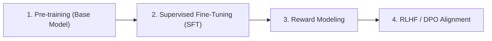

# 🚀 LLM Training & Alignment Pipeline

The complete pipeline for creating a production-grade LLM consists of 4 distinct stages described by Andrej Karpathy:

## 1. Pre-training
- **Goal**: Predict the next token across massive text datasets (Common Crawl, ArXiv, Github).
- **Compute**: Thousands of GPUs (H100/A100) running for months.

## 2. Supervised Fine-Tuning (SFT)
- High-quality human demonstrator conversations.
- Converts the document completer into a conversational assistant.

## 3. RLHF & DPO (Reinforcement Learning)
- Aligns outputs to human preference for accuracy, safety, and helpfulness.

---

## 🔗 Related Topics
- [[wiki/LLM_Architecture|LLM Architecture]]
- [[wiki/Index|Master Wiki Index]]
